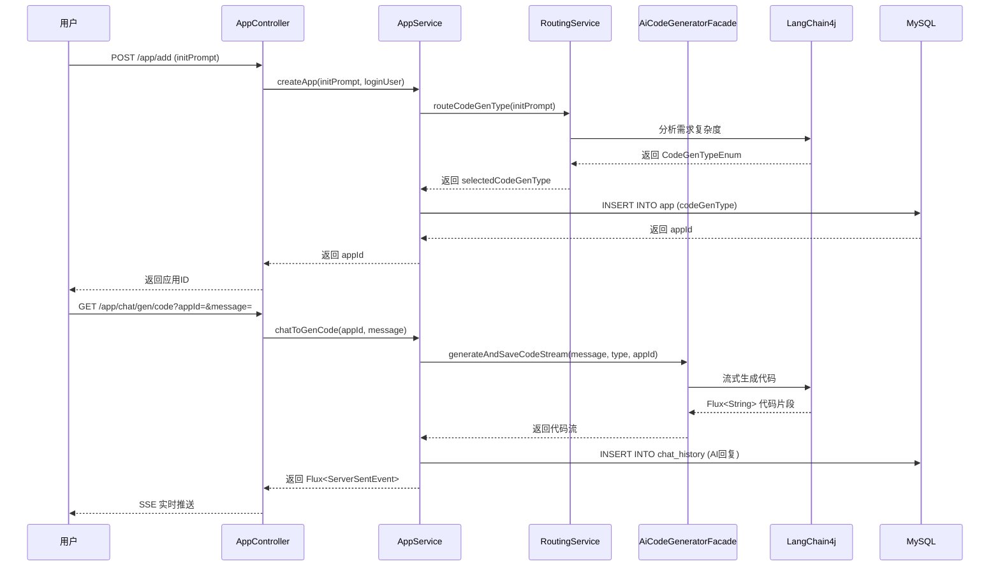
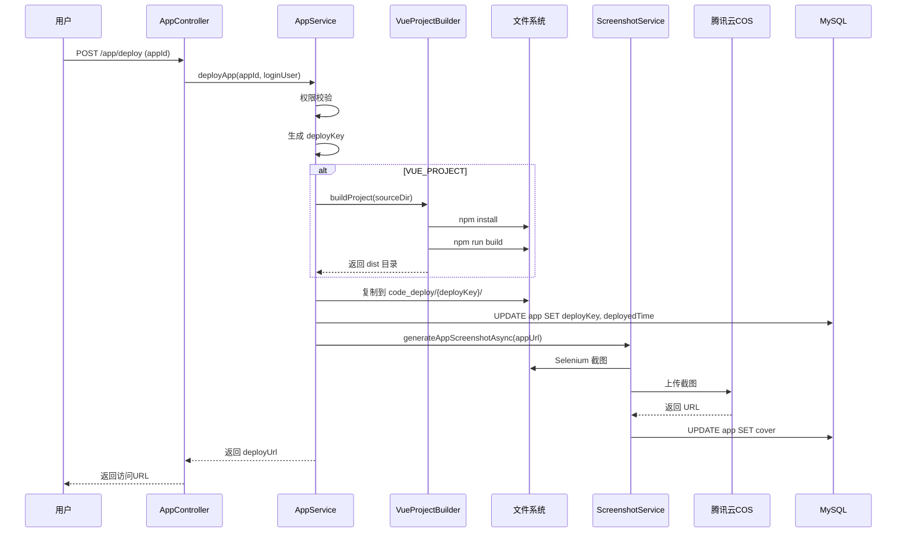
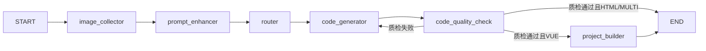

# AI 代码生成系统项目总结

## 一、项目概述

### 1.1 项目背景
本项目是一个基于 Spring Boot 3.x 和人工智能技术的智能代码生成平台，旨在通过自然语言交互的方式，帮助开发者快速生成前端代码。系统集成了 LangChain4j 框架和 LangGraph4j 工作流引擎，支持多种代码生成模式，包括原生 HTML、多文件项目和 Vue.js 工程化项目。

### 1.2 项目定位
- **项目名称**：AI Code Generator Platform（AI 代码生成平台）
- **技术栈**：Spring Boot 3.5.2 + Java 21 + LangChain4j 1.1.0 + LangGraph4j 1.6.0
- **核心功能**：基于 AI 的智能代码生成、应用管理、代码部署、实时监控
- **应用场景**：前端开发辅助、原型快速构建、教学演示、低代码开发

### 1.3 项目特色
1. **智能化路由**：根据用户需求自动选择最优代码生成策略
2. **工作流编排**：基于 LangGraph4j 实现多节点协作的代码生成流程
3. **流式响应**：支持 SSE（Server-Sent Events）实时推送生成进度
4. **自动化部署**：一键部署生成的应用到可访问的 URL
5. **质量保障**：内置代码质量检测机制，确保生成代码的可用性
6. **监控体系**：集成 Prometheus + Actuator 实现系统运行状态监控

---

## 二、系统架构设计

### 2.1 整体架构
系统采用分层架构设计，自下而上分为：

```
┌─────────────────────────────────────┐
│       表现层 (Controller Layer)      │
│  AppController | UserController     │
│  ChatHistoryController              │
└─────────────────────────────────────┘
                  ↓
┌─────────────────────────────────────┐
│       业务层 (Service Layer)         │
│  AppService | UserService           │
│  ChatHistoryService                 │
└─────────────────────────────────────┘
                  ↓
┌─────────────────────────────────────┐
│      核心层 (Core Layer)             │
│  AiCodeGeneratorFacade              │
│  CodeParser | CodeFileSaver         │
│  VueProjectBuilder                  │
└─────────────────────────────────────┘
                  ↓
┌─────────────────────────────────────┐
│    AI 服务层 (AI Service Layer)      │
│  AiCodeGeneratorService             │
│  AiCodeGenTypeRoutingService        │
│  ToolManager (文件操作工具集)        │
└─────────────────────────────────────┘
                  ↓
┌─────────────────────────────────────┐
│   工作流层 (Workflow Layer)          │
│  CodeGenWorkflow                    │
│  CodeGenSubgraphWorkflow            │
│  CodeGenConcurrentWorkflow          │
└─────────────────────────────────────┘
                  ↓
┌─────────────────────────────────────┐
│   数据持久层 (Data Access Layer)     │
│  MyBatis-Flex ORM                   │
│  MySQL | Redis                      │
└─────────────────────────────────────┘
```

### 2.2 模块划分

#### （1）控制器模块（controller）
- **AppController**：应用管理核心接口，包含创建、删除、更新、查询、聊天生成代码、下载、部署等功能
- **UserController**：用户注册、登录、信息管理
- **ChatHistoryController**：对话历史管理
- **StaticResourceController**：静态资源访问（部署后的应用）
- **WorkflowSseController**：工作流 SSE 流式输出接口
- **HealthController**：健康检查接口

#### （2）服务模块（service）
- **AppService**：应用业务逻辑，包括 CRUD、代码生成调度、应用部署
- **UserService**：用户认证与授权
- **ChatHistoryService**：对话历史的增删改查
- **ProjectDownloadService**：项目打包下载服务
- **ScreenshotService**：应用截图生成服务

#### （3）AI 模块（ai）
- **AiCodeGeneratorService**：AI 代码生成服务接口及工厂类
- **AiCodeGenTypeRoutingService**：智能路由服务，根据需求选择代码生成类型
- **Tools 工具集**：
  - FileReadTool：读取文件内容
  - FileWriteTool：写入文件
  - FileModifyTool：修改文件
  - FileDeleteTool：删除文件
  - FileDirReadTool：读取目录结构
  - ExitTool：退出工具调用
  - ToolManager：工具管理器

#### （4）核心模块（core）
- **AiCodeGeneratorFacade**：代码生成门面类，统一协调生成和保存流程
- **CodeParser**：代码解析器（HTML 解析、多文件解析）
- **CodeFileSaver**：代码文件保存器
- **VueProjectBuilder**：Vue 项目构建器（执行 npm install 和 build）
- **StreamHandlerExecutor**：流式处理器执行器

#### （5）工作流模块（langgraph4j）
- **CodeGenWorkflow**：标准代码生成工作流
- **CodeGenSubgraphWorkflow**：子图工作流
- **CodeGenConcurrentWorkflow**：并发工作流
- **Node 节点**：
  - ImageCollectorNode：图片收集节点
  - PromptEnhancerNode：提示词增强节点
  - RouterNode：路由节点
  - CodeGeneratorNode：代码生成节点
  - CodeQualityCheckNode：代码质量检测节点
  - ProjectBuilderNode：项目构建节点

#### （6）数据模型模块（model）
- **Entity**：User、App、ChatHistory 实体类
- **DTO**：请求数据传输对象
- **VO**：视图展示对象
- **Enum**：CodeGenTypeEnum（代码生成类型）、UserRoleEnum（用户角色）、ChatHistoryMessageTypeEnum（消息类型）

#### （7）配置模块（config）
- **StreamingChatModelConfig**：流式聊天模型配置
- **ReasoningStreamingChatModelConfig**：推理流式模型配置
- **RoutingAiModelConfig**：路由 AI 模型配置
- **RedisChatMemoryStoreConfig**：Redis 对话记忆存储配置
- **RedisCacheManagerConfig**：Redis 缓存管理器配置
- **CosClientConfig**：腾讯云 COS 对象存储配置
- **JsonConfig**：JSON 序列化配置
- **CorsConfig**：跨域配置

#### （8）限流模块（ratelimiter）
- **RateLimit 注解**：自定义限流注解
- **RateLimitAspect**：限流切面，基于 Redisson 实现滑动窗口限流
- **RateLimitType**：限流类型枚举（USER、IP、GLOBAL）

#### （9）监控模块（monitor）
- **AiModelMetricsCollector**：AI 模型指标收集器
- **AiModelMonitorListener**：AI 模型监控监听器
- **MonitorContext**：监控上下文
- **MonitorContextHolder**：监控上下文持有者（ThreadLocal）

#### （10）其他模块
- **annotation**：@AuthCheck 权限校验注解
- **aop**：权限校验切面
- **common**：通用响应类 BaseResponse、ResultUtils
- **exception**：全局异常处理、自定义异常 BusinessException
- **constant**：常量定义（AppConstant、UserConstant）
- **mapper**：MyBatis-Flex Mapper 接口
- **utils**：工具类（CacheKeyUtils、WebScreenshotUtils）
- **manager**：CosManager（COS 对象存储管理器）
- **generator**：MyBatis-Flex 代码生成器

---

## 三、核心技术实现

### 3.1 AI 代码生成流程

#### 3.1.1 智能路由机制
系统采用多例模式实现智能路由，根据用户的初始化 prompt 自动选择最合适的代码生成类型：

```java
// 路由流程
用户输入 initPrompt 
    → AiCodeGenTypeRoutingService.routeCodeGenType()
    → 调用大模型分析需求复杂度
    → 返回 CodeGenTypeEnum（HTML / MULTI_FILE / VUE_PROJECT）
```

**路由决策依据**：
- **HTML 模式**：简单单页面，无复杂交互
- **MULTI_FILE 模式**：需要 HTML + CSS + JS 分离的多文件项目
- **VUE_PROJECT 模式**：复杂的组件化应用，需要 Vue.js 工程化支持

#### 3.1.2 代码生成服务工厂
采用工厂模式 + 多例模式，为每个 appId 创建独立的 AI 服务实例：

```java
AiCodeGeneratorService service = aiCodeGeneratorServiceFactory
    .getAiCodeGeneratorService(appId, codeGenTypeEnum);
```

**优势**：
- 隔离不同应用的对话上下文
- 支持并发请求互不干扰
- 便于扩展新的代码生成类型

#### 3.1.3 流式生成与 SSE 推送
使用 Reactor 实现响应式流式输出：

```java
@GetMapping(value = "/chat/gen/code", produces = MediaType.TEXT_EVENT_STREAM_VALUE)
public Flux<ServerSentEvent<String>> chatToGenCode(...) {
    Flux<String> contentFlux = appService.chatToGenCode(appId, message, loginUser);
    return contentFlux
        .map(chunk -> ServerSentEvent.builder().data(jsonData).build())
        .concatWith(Mono.just(ServerSentEvent.builder().event("done").build()));
}
```

**消息类型**：
- `AiResponseMessage`：AI 部分响应内容
- `ToolRequestMessage`：工具调用请求
- `ToolExecutedMessage`：工具执行结果
- `Error Message`：错误信息

### 3.2 LangGraph4j 工作流引擎

#### 3.2.1 工作流节点设计
系统实现了完整的代码生成工作流，包含 6 个核心节点：

```
START → image_collector → prompt_enhancer → router 
    → code_generator → code_quality_check 
    → [条件分支] → project_builder → END
                            → skip_build → END
                            → fail → code_generator（重试）
```

**节点职责**：
1. **ImageCollectorNode**：收集用户上传的图片信息
2. **PromptEnhancerNode**：优化和增强用户输入的 prompt
3. **RouterNode**：根据需求复杂度路由到不同的生成策略
4. **CodeGeneratorNode**：调用大模型生成代码
5. **CodeQualityCheckNode**：检测生成代码的质量（语法、完整性）
6. **ProjectBuilderNode**：构建 Vue 项目（npm install + build）

#### 3.2.2 质检与重试机制
代码质量检测节点实现了智能重试：

```java
private String routeAfterQualityCheck(MessagesState<String> state) {
    QualityResult qualityResult = context.getQualityResult();
    if (!qualityResult.getIsValid()) {
        return "fail"; // 重新生成
    }
    return routeBuildOrSkip(state); // 继续后续流程
}
```

**质检维度**：
- 代码语法正确性
- 文件完整性检查
- 依赖关系验证
- 基本功能可用性

### 3.3 代码解析与保存

#### 3.3.1 模板方法模式
采用模板方法模式实现不同代码类型的解析和保存：

```java
// 解析器执行器
CodeParserExecutor.executeParser(completeCode, codeGenType)
    → HtmlCodeParser / MultiFileCodeParser

// 保存器执行器
CodeFileSaverExecutor.executeSaver(parsedResult, codeGenType, appId)
    → HtmlCodeFileSaverTemplate / MultiFileCodeFileSaverTemplate
```

**目录结构示例**：
```
tmp/code_output/
├── html_399716273616293888/
│   └── index.html
├── multi_file_2039204278176894976/
│   ├── index.html
│   ├── style.css
│   └── script.js
└── vue_project_397588957318590464/
    ├── src/
    ├── package.json
    ├── vite.config.js
    └── dist/  （构建后生成）
```

#### 3.3.2 Vue 项目构建
VueProjectBuilder 负责自动化构建 Vue 项目：

```java
public boolean buildProject(String projectPath) {
    // 1. 执行 npm install（超时 300 秒）
    executeNpmInstall(projectDir);
    // 2. 执行 npm run build（超时 180 秒）
    executeNpmBuild(projectDir);
    // 3. 验证 dist 目录生成
    return distDir.exists();
}
```

**异步构建优化**：
- 流式生成完成后触发异步构建
- 使用虚拟线程避免阻塞主流程
- 部署时同步等待构建完成

### 3.4 应用部署机制

#### 3.4.1 部署流程
```java
deployApp(appId, loginUser) {
    1. 权限校验（仅应用创建者可部署）
    2. 生成/获取 deployKey（6位随机字符串）
    3. 复制代码到部署目录 tmp/code_deploy/{deployKey}/
    4. Vue 项目特殊处理：使用 dist 目录
    5. 更新数据库 deployKey 和 deployedTime
    6. 异步生成应用截图
    7. 返回访问 URL: http://host/{deployKey}/
}
```

#### 3.4.2 静态资源映射
通过 StaticResourceController 实现动态资源映射：

```java
@GetMapping("/{deployKey}/**")
public void serveDeployedApp(@PathVariable String deployKey, ...) {
    String deployPath = CODE_DEPLOY_ROOT_DIR + "/" + deployKey;
    // 从部署目录读取文件并返回
}
```

#### 3.4.3 自动化截图
部署完成后自动生成应用封面：

```java
generateAppScreenshotAsync(appId, appUrl) {
    Thread.startVirtualThread(() -> {
        // 1. 使用 Selenium + WebDriver 截取网页
        String screenshotUrl = screenshotService.generateAndUploadScreenshot(appUrl);
        // 2. 上传到腾讯云 COS
        // 3. 更新 app.cover 字段
    });
}
```

### 3.5 数据持久化

#### 3.5.1 数据库设计
**核心表结构**：

1. **user 表**：用户信息
   - 字段：id, userAccount, userPassword, userName, userAvatar, userProfile, userRole
   - 索引：uk_userAccount（唯一）, idx_userName

2. **app 表**：应用信息
   - 字段：id, appName, cover, initPrompt, codeGenType, deployKey, deployedTime, priority, userId
   - 索引：uk_deployKey（唯一）, idx_appName, idx_userId

3. **chat_history 表**：对话历史
   - 字段：id, message, messageType, appId, userId, createTime
   - 索引：idx_appId, idx_createTime, idx_appId_createTime（游标查询）

#### 3.5.2 MyBatis-Flex ORM
使用 MyBatis-Flex 作为 ORM 框架，优势：
- 轻量级，性能优于 MyBatis-Plus
- 支持 Lambda 表达式构建查询
- 自动生成 Mapper 和 Entity

```java
QueryWrapper queryWrapper = QueryWrapper.create()
    .eq("userId", loginUser.getId())
    .like("appName", keyword)
    .orderBy("createTime", false);
Page<App> appPage = appService.page(Page.of(pageNum, pageSize), queryWrapper);
```

#### 3.5.3 Redis 缓存策略
**缓存场景**：
1. **Session 存储**：spring-session-data-redis
2. **对话记忆**：LangChain4j RedisChatMemoryStore
3. **业务缓存**：精选应用列表分页查询

```java
@Cacheable(
    value = "good_app_page",
    key = "T(CacheKeyUtils).generateKey(#appQueryRequest)",
    condition = "#appQueryRequest.pageNum <= 10"
)
public BaseResponse<Page<AppVO>> listGoodAppVOByPage(...)
```

**缓存配置**：
- TTL：3600 秒（1小时）
- Session 过期：30 天
- 使用 Caffeine 作为本地缓存补充

### 3.6 限流与安全

#### 3.6.1 自定义限流注解
基于 Redisson 实现滑动窗口限流：

```java
@RateLimit(limitType = RateLimitType.USER, rate = 5, rateInterval = 60)
public Flux<ServerSentEvent<String>> chatToGenCode(...)
```

**限流类型**：
- **USER**：按用户 ID 限流
- **IP**：按 IP 地址限流
- **GLOBAL**：全局限流

**实现原理**：
- 使用 Redis ZSET 存储请求时间戳
- 滑动窗口算法计算当前窗口内请求数
- AOP 切面拦截方法进行限流判断

#### 3.6.2 权限控制
**@AuthCheck 注解**：
```java
@AuthCheck(mustRole = UserConstant.ADMIN_ROLE)
public BaseResponse<Boolean> deleteAppByAdmin(...)
```

**权限级别**：
- **user**：普通用户，只能操作自己的应用
- **admin**：管理员，可操作所有应用

**实现方式**：AOP 切面 + Session 验证

#### 3.6.3 异常处理
全局异常处理器统一返回格式：

```java
@RestControllerAdvice
public class GlobalExceptionHandler {
    @ExceptionHandler(BusinessException.class)
    public BaseResponse<?> handleBusinessException(BusinessException e) {
        return ResultUtils.error(e.getCode(), e.getMessage());
    }
}
```

**错误码规范**：
- 40000：参数错误（PARAMS_ERROR）
- 40100：未登录（NOT_LOGIN_ERROR）
- 40300：无权限（NO_AUTH_ERROR）
- 40400：资源不存在（NOT_FOUND_ERROR）
- 50000：系统错误（SYSTEM_ERROR）

### 3.7 监控体系

#### 3.7.1 Actuator + Prometheus
集成 Spring Boot Actuator 暴露监控端点：

```yaml
management:
  endpoints:
    web:
      exposure:
        include: health,info,prometheus
```

**监控指标**：
- JVM 内存使用情况
- GC 次数和耗时
- HTTP 请求 QPS、响应时间
- 数据库连接池状态
- Redis 连接状态

#### 3.7.2 AI 模型监控
自定义监控收集器记录 AI 调用情况：

```java
AiModelMetricsCollector {
    - 记录每次 AI 调用的 token 消耗
    - 统计响应时间
    - 追踪错误率
    - 关联 userId 和 appId
}
```

**监控上下文传递**：
```java
MonitorContextHolder.setContext(
    MonitorContext.builder()
        .userId(loginUser.getId().toString())
        .appId(appId.toString())
        .build()
);
```

---

## 四、关键技术选型

### 4.1 后端框架
| 技术 | 版本 | 用途 |
|------|------|------|
| Spring Boot | 3.5.2 | 核心框架 |
| Java | 21 | 编程语言（使用虚拟线程） |
| MyBatis-Flex | 1.11.6 | ORM 框架 |
| MySQL | 8.0+ | 关系型数据库 |
| Redis | 7.0+ | 缓存和会话存储 |
| Redisson | 3.50.0 | Redis 客户端（分布式锁、限流） |

### 4.2 AI 与大模型
| 技术 | 版本 | 用途 |
|------|------|------|
| LangChain4j | 1.1.0 | Java 版 LangChain，AI 应用开发框架 |
| LangGraph4j | 1.6.0-rc2 | 工作流编排引擎 |
| OpenAI API | - | GPT 系列模型接入 |
| Alibaba DashScope | 2.21.1 | 通义千问模型接入 |
| Caffeine | - | 本地缓存（AI 响应缓存） |

### 4.3 前端与部署
| 技术 | 版本 | 用途 |
|------|------|------|
| Vue.js | 3.x | 前端框架（生成的项目） |
| Vite | 5.x | 前端构建工具 |
| Selenium | 4.33.0 | 浏览器自动化（截图） |
| WebDriverManager | 6.1.0 | 浏览器驱动管理 |

### 4.4 工具库
| 技术 | 版本 | 用途 |
|------|------|------|
| Hutool | 5.8.38 | Java 工具类库 |
| Lombok | 1.18.36 | 简化 Java 代码 |
| Knife4j | 4.4.0 | API 文档（Swagger 增强） |
| 腾讯云 COS SDK | 5.6.227 | 对象存储（截图上传） |

### 4.5 监控与测试
| 技术 | 用途 |
|------|------|
| Spring Boot Actuator | 应用监控 |
| Micrometer + Prometheus | 指标收集和可视化 |
| JUnit 5 | 单元测试 |
| Reactor Test | 响应式流测试 |

---

## 五、核心业务流程

### 5.1 应用创建与代码生成



### 5.2 应用部署流程



### 5.3 工作流执行流程



---

## 六、项目亮点与创新

### 6.1 技术创新点

#### （1）基于 LangGraph4j 的工作流编排
- **创新点**：将代码生成过程拆分为多个独立节点，实现流程可视化和灵活调整
- **优势**：
  - 每个节点可独立测试和优化
  - 支持条件分支和循环重试
  - 便于扩展新节点（如代码审查、性能优化）

#### （2）智能路由与多策略生成
- **创新点**：根据用户需求自动选择最优生成策略，而非单一模式
- **技术实现**：
  - 多例模式的 AI 服务工厂
  - 基于大模型的意图识别
  - 三种生成类型覆盖不同复杂度场景

#### （3）流式生成与实时反馈
- **创新点**：结合 SSE 和 Reactor 实现真正的流式体验
- **用户体验**：
  - 用户可实时看到代码生成进度
  - 工具调用过程透明可见
  - 降低等待焦虑感

#### （4）自动化质检与重试
- **创新点**：引入代码质量检测环节，不合格自动重试
- **质检维度**：
  - 语法正确性
  - 文件完整性
  - 依赖关系
  - 基本功能验证

#### （5）虚拟线程优化并发
- **创新点**：利用 Java 21 虚拟线程提升并发性能
- **应用场景**：
  - 异步 Vue 项目构建
  - 后台截图任务
  - 高并发 AI 请求处理

### 6.2 工程实践亮点

#### （1）设计模式应用
- **工厂模式**：AiCodeGeneratorServiceFactory、AiCodeGenTypeRoutingServiceFactory
- **模板方法模式**：CodeFileSaverTemplate、CodeParser
- **门面模式**：AiCodeGeneratorFacade 统一入口
- **策略模式**：不同 CodeGenTypeEnum 的处理策略
- **单例模式**：ToolManager 管理工具实例

#### （2）响应式编程
- 全面使用 Reactor 实现非阻塞 IO
- Flux 和 Mono 组合实现复杂流处理
- 背压机制防止内存溢出

#### （3）缓存优化
- 多级缓存策略（Caffeine + Redis）
- 条件缓存（只缓存前 10 页精选应用）
- 缓存键生成工具类统一管理

#### （4）安全与限流
- 自定义注解实现声明式限流
- 基于角色的访问控制（RBAC）
- SQL 注入防护（MyBatis-Flex 预编译）
- XSS 防护（输入过滤）

#### （5）可观测性
- 完善的日志记录（SLF4J + Logback）
- 结构化监控指标（Prometheus）
- 链路追踪上下文传递（MonitorContext）
- 异常统一处理和告警

---

## 七、性能优化与实践

### 7.1 数据库优化

#### （1）索引设计
```sql
-- 应用表
UNIQUE KEY uk_deployKey (deployKey)  -- 部署标识唯一性
INDEX idx_appName (appName)           -- 应用名称模糊查询
INDEX idx_userId (userId)             -- 用户应用列表查询

-- 对话历史表
INDEX idx_appId (appId)               -- 应用对话查询
INDEX idx_createTime (createTime)     -- 时间范围查询
INDEX idx_appId_createTime (appId, createTime)  -- 游标分页
```

#### （2）批量查询优化
避免 N+1 问题，批量加载关联数据：

```java
Set<Long> userIds = appList.stream().map(App::getUserId).collect(Collectors.toSet());
Map<Long, UserVO> userVOMap = userService.listByIds(userIds).stream()
    .collect(Collectors.toMap(User::getId, userService::getUserVO));
```

#### （3）分页限制
- 每页最多 20 条记录
- 防止深分页性能问题

### 7.2 缓存优化

#### （1）热点数据缓存
```java
@Cacheable(value = "good_app_page", condition = "#appQueryRequest.pageNum <= 10")
```
- 只缓存前 10 页（最常访问）
- 减少数据库压力

#### （2）Session 优化
- 使用 Redis 集中存储 Session
- 支持分布式部署
- Session 过期时间 30 天

#### （3）本地缓存
- Caffeine 缓存 AI 模型配置
- 避免重复创建昂贵对象

### 7.3 AI 调用优化

#### （1）Token 节约
- Prompt 模板精简
- 上下文窗口管理
- 对话历史截断策略

#### （2）并发控制
- 限流保护（每用户每分钟 5 次）
- 虚拟线程提高吞吐量
- 异步任务解耦

#### （3）错误重试
- 网络波动自动重试
- 质检失败重新生成
- 降级策略（返回友好提示）

### 7.4 文件 IO 优化

#### （1）异步构建
```java
Thread.ofVirtual().name("vue-builder-" + System.currentTimeMillis()).start(() -> {
    buildProject(projectPath);
});
```

#### （2）流式写入
- 代码片段实时追加到 StringBuilder
- 避免大字符串拼接开销

#### （3）临时文件清理
- 定期清理过期的 code_output
- 部署目录按需保留

---

## 八、测试与质量保证

### 8.1 单元测试

#### 测试覆盖模块
- **AI 服务测试**：AiCodeGeneratorServiceTest、AiCodeGenTypeRoutingServiceTest
- **核心逻辑测试**：AiCodeGeneratorFacadeTest、CodeParserTest
- **工作流测试**：CodeGenWorkflowTest、CodeGenSubgraphWorkflowTest、CodeGenConcurrentWorkflowTest
- **工具测试**：WebScreenshotUtilsTest

#### 测试框架
- JUnit 5：测试框架
- Mockito：Mock 依赖
- Reactor Test：响应式流测试

### 8.2 集成测试

#### 测试场景
1. **完整代码生成流程**：从创建应用到生成代码
2. **部署流程**：代码部署和访问验证
3. **限流测试**：高频请求限流效果
4. **权限测试**：不同角色权限验证

### 8.3 代码质量

#### 代码规范
- 统一的命名规范（驼峰命名）
- 完善的注释（JavaDoc）
- 异常处理规范化
- 日志记录标准化

#### 静态检查
- IDE 代码检查（IntelliJ IDEA）
- 编译警告零容忍
- 依赖冲突检测

---

## 九、部署与运维

### 9.1 环境要求

#### 运行时环境
- **JDK**：21+（必须支持虚拟线程）
- **MySQL**：8.0+
- **Redis**：7.0+
- **Node.js**：18+（Vue 项目构建）
- **Chrome Browser**：最新版（截图功能）

#### 构建工具
- **Maven**：3.8+
- **IDE**：IntelliJ IDEA 2023+

### 9.2 配置文件

#### application.yml 核心配置
```yaml
spring:
  datasource:
    url: jdbc:mysql://localhost:3307/ai_code
    username: root
    password: 123456
  data:
    redis:
      host: localhost
      port: 6379
      password: 123456
      
server:
  port: 8081
  servlet:
    context-path: /api

# LangChain4j 配置
langchain4j:
  open-ai:
    api-key: ${OPENAI_API_KEY}
    chat-model:
      model-name: gpt-4
```

#### 环境变量
- `OPENAI_API_KEY`：OpenAI API 密钥
- `DASHSCOPE_API_KEY`：阿里云 DashScope API 密钥
- `COS_SECRET_ID`：腾讯云 COS SecretId
- `COS_SECRET_KEY`：腾讯云 COS SecretKey

### 9.3 启动流程

```bash
# 1. 初始化数据库
mysql -u root -p < sql/create_table.sql

# 2. 启动 Redis
redis-server

# 3. 启动 MySQL
mysqld

# 4. Maven 构建
mvn clean package -DskipTests

# 5. 运行应用
java -jar target/ai-code-springboot-0.0.1-SNAPSHOT.jar

# 6. 访问 API 文档
http://localhost:8081/api/doc.html
```

### 9.4 监控与告警

#### Prometheus 监控
```yaml
# prometheus.yml
scrape_configs:
  - job_name: 'ai-code-springboot'
    metrics_path: '/api/actuator/prometheus'
    static_configs:
      - targets: ['localhost:8081']
```

#### Grafana 仪表盘
- JVM 内存监控
- GC 频率和耗时
- HTTP 请求 QPS
- AI 调用成功率
- 数据库连接池状态

---

## 十、项目不足与改进方向

### 10.1 当前局限性

#### （1）功能层面
- **代码类型有限**：仅支持前端代码（HTML/Vue），不支持后端代码生成
- **框架支持单一**：Vue 项目仅支持 Vite 构建，缺少 Webpack 等选项
- **缺乏代码编辑**：生成后无法在线编辑和调整
- **版本管理缺失**：没有代码版本控制和回滚机制

#### （2）性能层面
- **大文件处理**：超大项目生成时内存占用较高
- **并发瓶颈**：AI API 调用存在速率限制
- **冷启动慢**：首次构建 Vue 项目耗时长（npm install）

#### （3）安全层面
- **代码沙箱**：生成的代码未经过安全扫描，可能存在 XSS 风险
- **API 密钥管理**：密钥硬编码在配置文件，缺乏密钥轮换机制
- **SQL 注入**：虽然使用预编译，但动态查询仍需加强审计

#### （4）用户体验
- **错误提示**：部分错误信息不够友好，技术术语较多
- **进度展示**：工作流执行进度可视化不足
- **历史记录**：对话历史仅支持线性查看，缺少搜索和筛选

### 10.2 改进方向

#### （1）短期优化（1-3 个月）
1. **增加代码类型**：
   - 支持 React 项目生成
   - 支持 TypeScript 类型推断
   - 支持 Tailwind CSS 样式

2. **性能优化**：
   - 引入 CDN 加速静态资源
   - 优化 npm 依赖缓存（使用 pnpm）
   - 增加请求队列和优先级调度

3. **用户体验**：
   - 增加代码预览功能（实时渲染）
   - 优化错误提示信息
   - 添加代码导出为 ZIP 功能

4. **安全性**：
   - 集成代码安全扫描（SonarQube）
   - 实现 API 密钥加密存储
   - 增加请求签名验证

#### （2）中期规划（3-6 个月）
1. **功能扩展**：
   - 支持后端代码生成（Spring Boot）
   - 支持数据库 Schema 设计
   - 支持 API 接口自动生成

2. **智能化提升**：
   - 引入 RAG（检索增强生成）技术
   - 建立代码知识库和最佳实践库
   - 实现代码风格学习和个性化适配

3. **协作功能**：
   - 支持多人协作编辑
   - 增加评论和反馈机制
   - 实现应用分享和公开市场

4. **DevOps 集成**：
   - 支持一键部署到云平台（阿里云、腾讯云）
   - 集成 CI/CD 流水线
   - 自动化测试用例生成

#### （3）长期愿景（6-12 个月）
1. **平台化**：
   - 打造低代码开发平台
   - 提供可视化拖拽界面
   - 支持自定义组件库

2. **生态建设**：
   - 开放插件系统
   - 建立开发者社区
   - 提供 SDK 和 API 市场

3. **商业化**：
   - 企业版私有化部署
   - 按用量计费模式
   - 专业技术支持服务

4. **AI 能力增强**：
   - 多模态输入（语音、手绘草图）
   - 自动 Bug 修复和优化建议
   - 智能代码重构和性能优化

---

## 十一、学习收获与技术成长

### 11.1 技术能力提升

#### （1）后端开发
- **Spring Boot 3.x 新特性**：虚拟线程、GraalVM 原生镜像
- **响应式编程**：Reactor 框架的深度应用
- **ORM 框架对比**：MyBatis-Flex vs MyBatis-Plus vs JPA
- **分布式技术**：Redis 分布式锁、限流、会话共享

#### （2）AI 工程化
- **LangChain4j 实践**：Java 生态的 LLM 应用开发
- **Prompt Engineering**：提示词设计和优化技巧
- **工作流编排**：LangGraph4j 的状态管理和节点设计
- **向量数据库**：Redis 向量存储和相似度搜索

#### （3）系统设计
- **设计模式应用**：工厂、模板方法、策略、门面等模式的实际运用
- **微服务思想**：模块化设计和职责分离
- **性能优化**：缓存策略、数据库优化、异步处理
- **可观测性**：监控、日志、链路追踪体系建设

#### （4）工程实践
- **代码规范**：阿里巴巴 Java 开发手册
- **版本控制**：Git Flow 工作流
- **CI/CD**：Maven 自动化构建和部署
- **文档编写**：API 文档（Knife4j）、技术文档

### 11.2 问题解决能力

#### （1）调试技巧
- **日志分析**：通过结构化日志快速定位问题
- **性能剖析**：使用 JProfiler 分析内存泄漏
- **网络抓包**：Wireshark 分析 HTTP 请求
- **断点调试**：IDEA 远程调试技巧

#### （2）故障排查
- **ClassNotFoundException**：Maven 依赖冲突解决
- **Bean 冲突**：Spring 容器 Bean 命名规范
- **死锁问题**：Redis 分布式锁超时设置
- **内存溢出**：JVM 参数调优和 GC 策略

#### （3）性能调优
- **数据库慢查询**：EXPLAIN 分析和索引优化
- **接口响应慢**：异步化和缓存优化
- **并发瓶颈**：线程池参数调整和虚拟线程应用
- **AI 调用延迟**：流式响应和超时控制

### 11.3 架构思维培养

#### （1）分层架构
- 理解各层职责和边界
- 避免循环依赖和过度耦合
- 面向接口编程的重要性

#### （2）可扩展性设计
- 开闭原则的实际应用
- 插件化架构思想
- 配置驱动的设计模式

#### （3）容错与降级
- 熔断器模式（Resilience4j）
- 降级策略和默认值
- 幂等性设计保证数据一致性

#### （4）安全性考虑
- 最小权限原则
- 输入验证和输出编码
- 敏感信息加密存储

---

## 十二、总结与展望

### 12.1 项目总结

本项目成功实现了一个功能完善的 AI 代码生成平台，具有以下特点：

1. **技术先进性**：采用 Spring Boot 3.x、Java 21、LangChain4j 等最新技术栈
2. **架构合理性**：分层清晰、模块独立、易于维护和扩展
3. **功能完整性**：涵盖应用管理、代码生成、部署、监控等全流程
4. **用户体验佳**：流式响应、实时反馈、自动化部署
5. **工程质量高**：完善的测试、监控、限流、异常处理

### 12.2 应用价值

#### （1）对开发者
- **提高效率**：快速生成原型代码，减少重复劳动
- **降低门槛**：非专业开发者也能创建前端应用
- **学习参考**：生成的代码可作为学习样例

#### （2）对企业
- **降低成本**：减少初级开发人员投入
- **加速迭代**：快速验证产品想法
- **标准化**：统一的代码规范和最佳实践

#### （3）对教育
- **教学工具**：帮助学生理解代码结构
- **实践平台**：提供真实的开发场景
- **激发兴趣**：降低编程入门难度

### 12.3 未来展望

随着 AI 技术的快速发展，代码生成领域将迎来更多机遇：

1. **多模态融合**：结合图像、语音、文本等多种输入方式
2. **个性化定制**：学习开发者编码风格，生成更符合个人习惯的代码
3. **全栈生成**：从前端到后端再到数据库的一站式生成
4. **智能运维**：自动生成监控、日志、告警配置
5. **协作进化**：人机协作成为主流开发模式

本项目作为探索性实践，为后续深入研究奠定了坚实基础。通过不断迭代和优化，有望成为一款真正实用的智能开发助手。

---

## 附录

### A. 项目结构树
```
ai-code-springboot/
├── src/
│   ├── main/
│   │   ├── java/com/suoyike/aicodespringboot/
│   │   │   ├── ai/                    # AI 服务层
│   │   │   ├── annotation/            # 自定义注解
│   │   │   ├── aop/                   # 切面
│   │   │   ├── common/                # 通用类
│   │   │   ├── config/                # 配置类
│   │   │   ├── constant/              # 常量
│   │   │   ├── controller/            # 控制器
│   │   │   ├── core/                  # 核心逻辑
│   │   │   ├── exception/             # 异常处理
│   │   │   ├── generator/             # 代码生成器
│   │   │   ├── langgraph4j/           # 工作流
│   │   │   ├── manager/               # 管理器
│   │   │   ├── mapper/                # 数据访问
│   │   │   ├── model/                 # 数据模型
│   │   │   ├── monitor/               # 监控
│   │   │   ├── ratelimiter/           # 限流
│   │   │   ├── service/               # 服务层
│   │   │   └── utils/                 # 工具类
│   │   └── resources/
│   │       ├── mapper/                # MyBatis XML
│   │       ├── prompt/                # AI 提示词模板
│   │       ├── application.yml        # 配置文件
│   │       └── application-local.yml  # 本地配置
│   └── test/                          # 测试代码
├── sql/                               # 数据库脚本
├── tmp/                               # 临时文件
│   ├── code_output/                   # 生成的代码
│   ├── code_deploy/                   # 部署的代码
│   └── screenshots/                   # 应用截图
├── pom.xml                            # Maven 配置
└── README.md                          # 项目说明
```

### B. 核心 API 列表

| 接口路径 | 方法 | 功能 | 权限 |
|---------|------|------|------|
| /api/app/add | POST | 创建应用 | 登录用户 |
| /api/app/delete | POST | 删除应用 | 本人/管理员 |
| /api/app/update | POST | 更新应用 | 本人 |
| /api/app/get/vo | GET | 获取应用详情 | 公开 |
| /api/app/my/list/page/vo | POST | 我的应用列表 | 登录用户 |
| /api/app/good/list/page/vo | POST | 精选应用列表 | 公开 |
| /api/app/chat/gen/code | GET | 聊天生成代码（SSE） | 登录用户 |
| /api/app/download/{appId} | GET | 下载应用代码 | 本人 |
| /api/app/deploy | POST | 部署应用 | 本人 |
| /api/app/admin/delete | POST | 管理员删除 | 管理员 |
| /api/app/admin/update | POST | 管理员更新 | 管理员 |
| /api/app/admin/list/page/vo | POST | 管理员列表 | 管理员 |
| /api/user/register | POST | 用户注册 | 公开 |
| /api/user/login | POST | 用户登录 | 公开 |
| /api/user/logout | POST | 用户登出 | 登录用户 |
| /api/chat/history/list | GET | 对话历史列表 | 本人 |
| /api/chat/history/delete | POST | 删除对话历史 | 本人 |
| /{deployKey}/** | GET | 访问部署的应用 | 公开 |

### C. 参考文献

1. Spring Boot 官方文档：https://spring.io/projects/spring-boot
2. LangChain4j 文档：https://docs.langchain4j.dev/
3. LangGraph4j GitHub：https://github.com/bsorrentino/langgraph4j
4. MyBatis-Flex 官方文档：https://mybatis-flex.com/
5. Reactor 参考指南：https://projectreactor.io/docs/core/release/reference/
6. Redisson 文档：https://redisson.org/docs/
7. 阿里巴巴 Java 开发手册：https://github.com/alibaba/p3c

---

**作者**：蓑衣客  
**日期**：2026年4月  
**版本**：v1.0  
